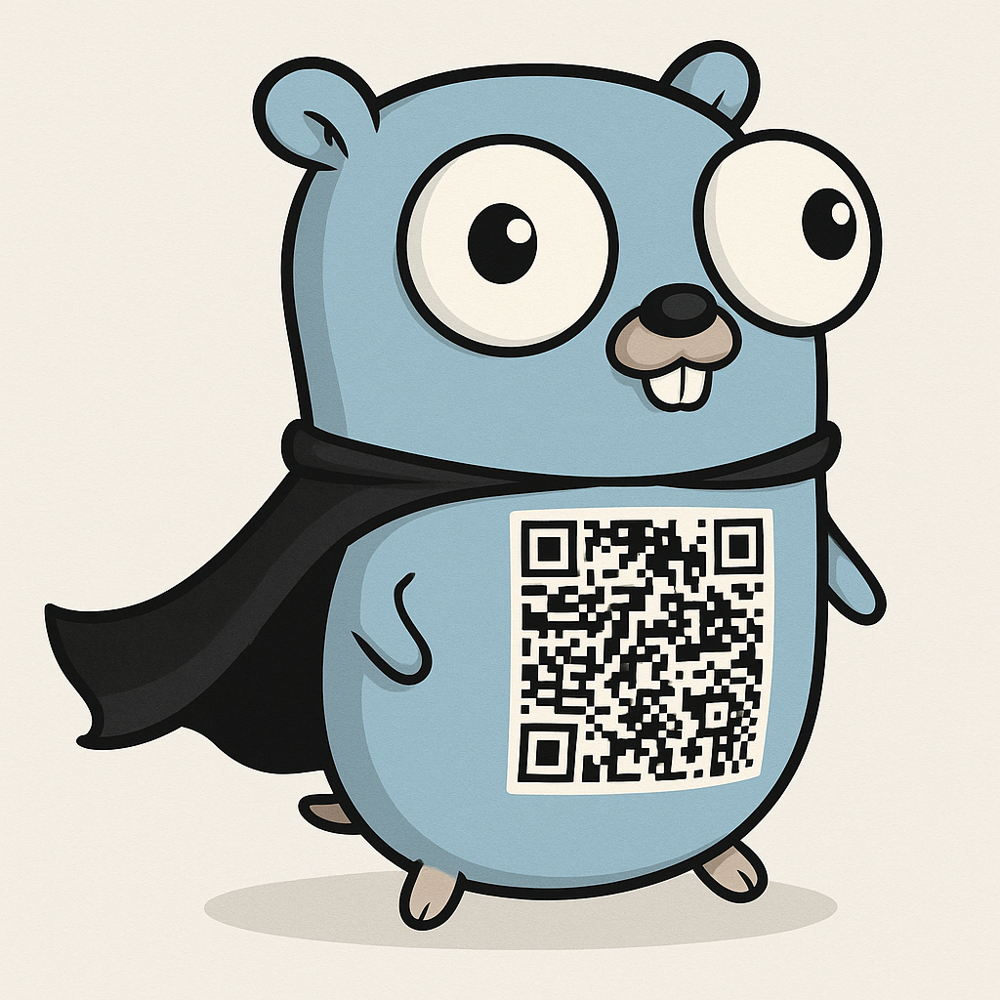

# QR Code Encoder



Modern and optimized rewrite of [go-qrcode](https://github.com/skip2/go-qrcode)

## Requirements

- Golang 1.24.1 or higher
  - [Download](https://go.dev/dl/)

## Usage

```go
package main

import (
	"image/color"
	"log"

	"github.com/i9si-sistemas/qrcode"
)

func main() {
	qr, err := qrcode.NewWithForcedVersion(
		"https://www.i9sisistemas.com.br/",
		11,
		qrcode.Highest,
	)
	if err != nil {
		log.Fatalf("Failed to create QR Code: %v", err)
	}

	qr.DisableBorder = true
	qr.ForegroundColor = color.RGBA{0x00, 0x00, 0x00, 0xff}
	qr.BackgroundColor = color.RGBA{0xef, 0xef, 0xef, 0xff}

	if err := qr.WriteFile(256, "qrcode_example.png"); err != nil {
		log.Fatalf("Failed to save QR Code: %v", err)
	}
}
```
